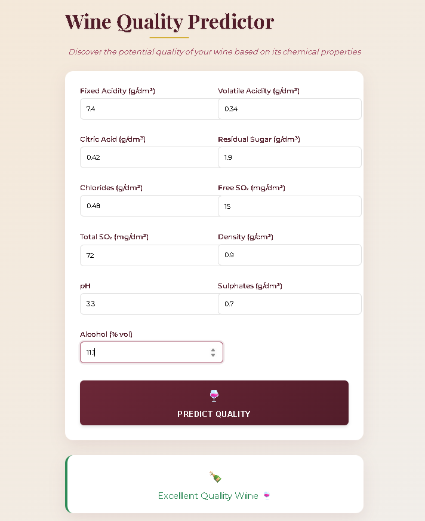
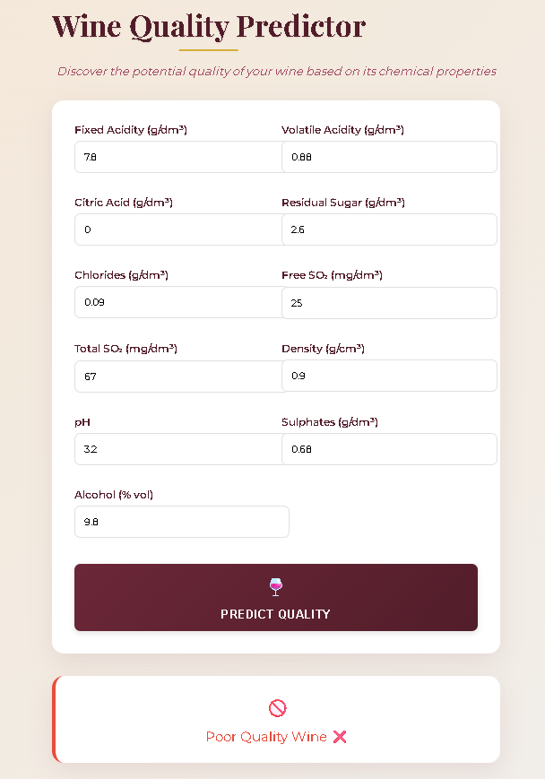

# 🍷 Wine Quality Prediction (Flask + ML)

This project is a **Wine Quality Predictor** built using:
- Python
- Flask (Web Framework)
- Scikit-learn (Machine Learning)
- HTML/CSS (Frontend)

It uses a trained ML model with **PCA** and **scaling** to predict whether wine is of **Excellent** or **Poor** quality based on 11 physicochemical properties.

---

## 📂 Project Structure
```
├── app.py                # Flask web app
├── train_model.py        # Trains and saves the ML model, scaler, and PCA
├── templates/
│   └── index.html        # Frontend form + result display
├── static/               # (Optional) CSS/JS files
├── model.pkl             # Saved trained model
├── scaler.pkl            # Saved StandardScaler
├── pca.pkl               # Saved PCA transformer
└── README.md             # This file
```

---

## ⚙️ Setup Instructions

### 1️⃣ Clone the repository
```bash
git clone <your-repo-url>
cd wine-quality-prediction
```

### 2️⃣ Install dependencies
```bash
pip install -r requirements.txt
```

### 3️⃣ Train the model
```bash
python train_model.py
```
This will generate:
- `model.pkl`
- `scaler.pkl`
- `pca.pkl`

### 4️⃣ Run the Flask app
```bash
python app.py
```
Flask will start on:
```
http://127.0.0.1:5000
```

---

## 🧪 Testing

### Sample **Good Wine** input:
| Feature                  | Value  |
|--------------------------|--------|
| Fixed Acidity            | 7.4    |
| Volatile Acidity         | 0.34   |
| Citric Acid              | 0.42   |
| Residual Sugar           | 1.9    |
| Chlorides                | 0.048  |
| Free Sulfur Dioxide      | 15     |
| Total Sulfur Dioxide     | 72     |
| Density                  | 0.9951 |
| pH                       | 3.34   |
| Sulphates                | 0.74   |
| Alcohol                  | 11.4   |

Expected Output: **Excellent Quality Wine 🍷**

---

### Sample **Poor Wine** input:
| Feature                  | Value  |
|--------------------------|--------|
| Fixed Acidity            | 7.8    |
| Volatile Acidity         | 0.88   |
| Citric Acid              | 0.0    |
| Residual Sugar           | 2.6    |
| Chlorides                | 0.098  |
| Free Sulfur Dioxide      | 25     |
| Total Sulfur Dioxide     | 67     |
| Density                  | 0.9968 |
| pH                       | 3.2    |
| Sulphates                | 0.68   |
| Alcohol                  | 9.8    |

Expected Output: **Poor Quality Wine ❌**

---

